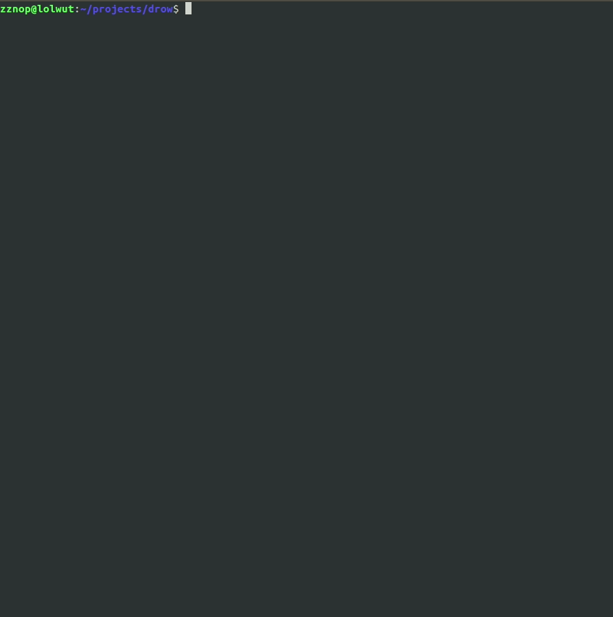

# drow 

## Description

### TL;DR
drow is a command-line utility that is used to inject code and hook the entrypoint of ELF executables (post-build). It
takes unmodified ELF executables as input and exports a modified ELF contianing an embedded user-supplied payload that
executes at runtime.

### Slightly more detail ...

Drow takes the following steps to create the new patched ELF:

1. Map in the umodified target ELF executable and the user-supplied payload, a position-independent blob
2. Locate the first executable segment by parsing program headers
3. Locate the last section in the executable segment by parsing section headers
4. Expand the last section (in the segment) section header's `sh_size` and program header's `p_memsz`/`p_filesz` by
   the size of the user-supplied payload
5. Fixup section headers' `sh_offset`'s and program headers' `p_offset`'s (move down sections and segments to make room
   for the payload and a small "stager stub")
6. Fix offsets in the ELF header (`e_shoff`, `e_phoff`, etc..)
7. Modify the ELF header `e_entry` (ELF entrypoint offset) to point to the injected code
8. Create a new ELF containing the injected code and modified ELF headers

In addition to injecting the user-supplied payload, drow injects a small code stub that is prepended to the beginning of
the payload. This stub is designed to call into the payload. If the payload is written to return to the caller, after the
payload returns the stager then tailcalls into `_start`, restoring execution so the program can run as intended.

## Building

Install `gcc` and `scons`. Then run `scons` from the root of the directory.

## Other Information

In addition to building drow, this project also builds a Linux x86-64 payload named `rappers_delight.bin` that simply
prints to `stdout`. This can be used for testing. Currently, drow only works with ELF64 files targetting x86-64.

## Other Work

There has been a lot of open source work done in this domain. I encourage you to also check out the following projects
and associated publications:

* The Cerberus ELF Interface: http://phrack.org/issues/61/8.html
* The Backdoor Factory: https://github.com/secretsquirrel/the-backdoor-factory
* ELFSH: http://www.eresi-project.org/ 
